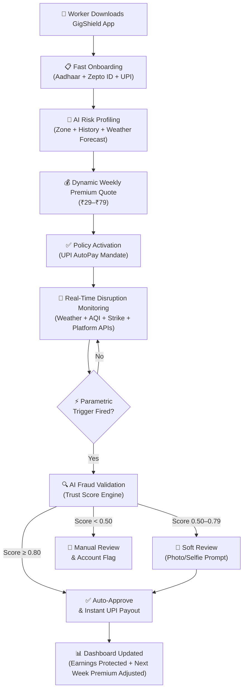
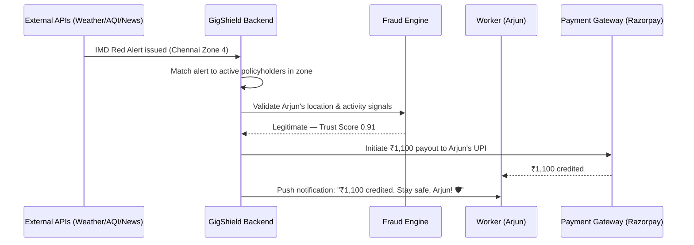
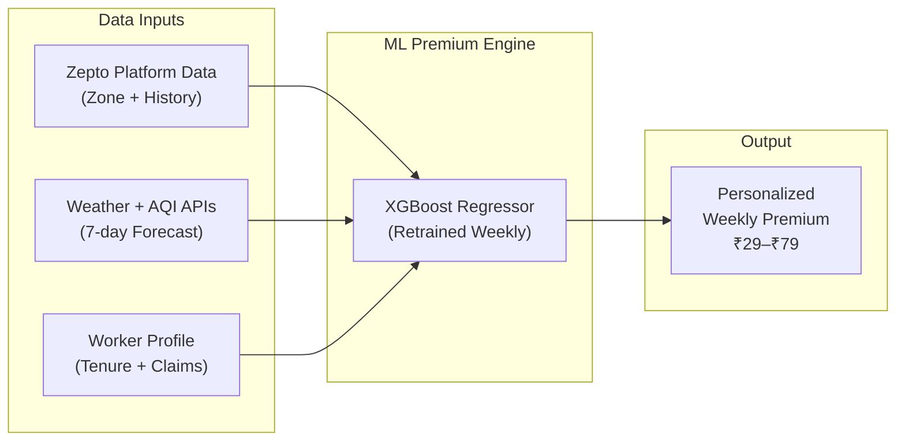
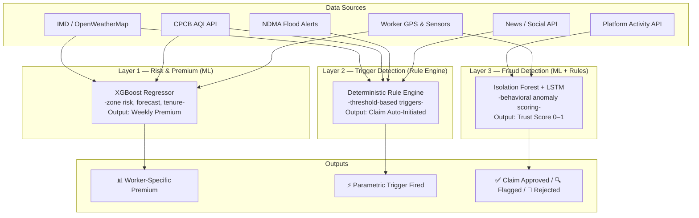
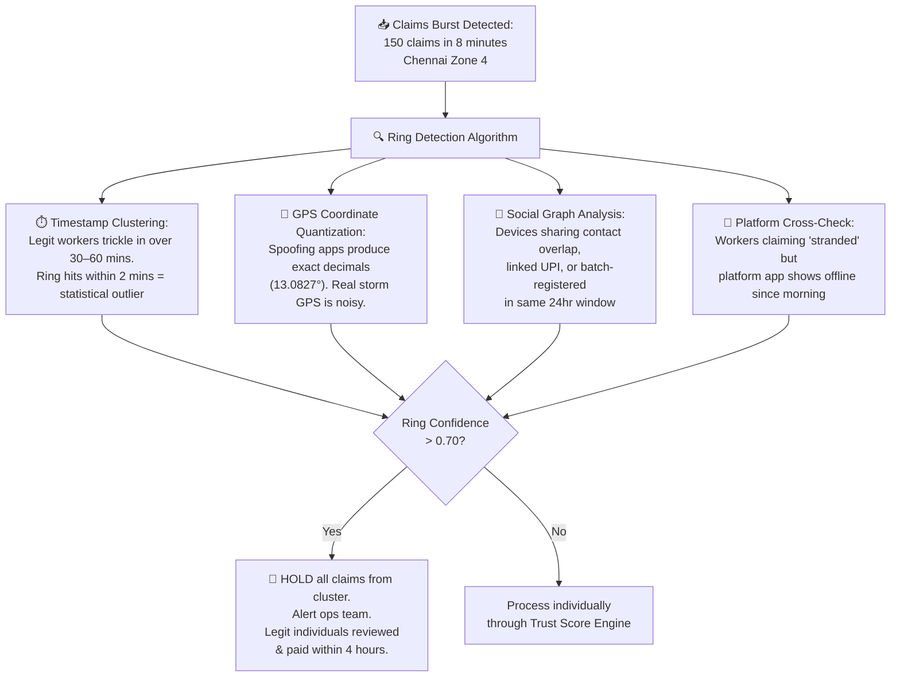
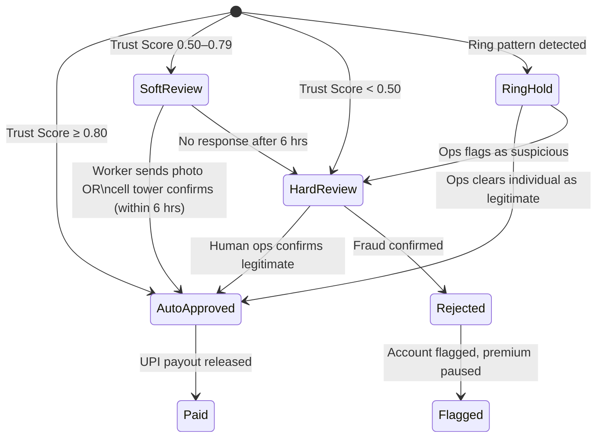
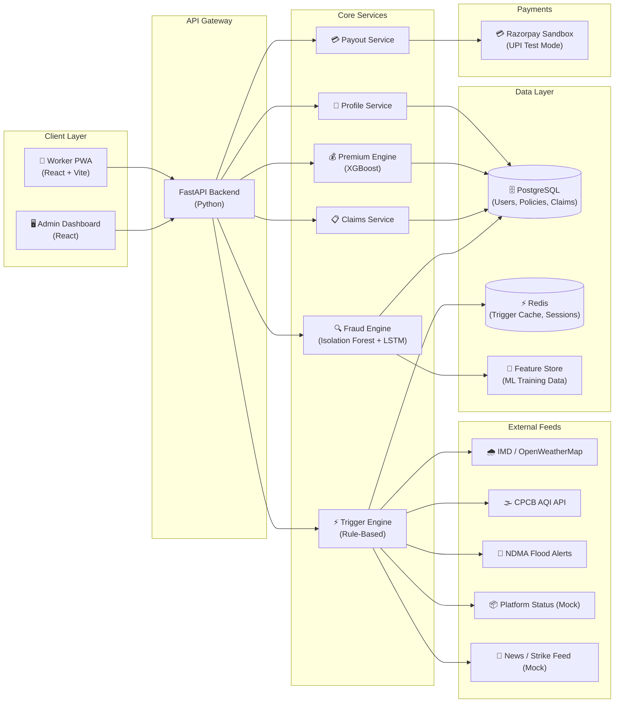
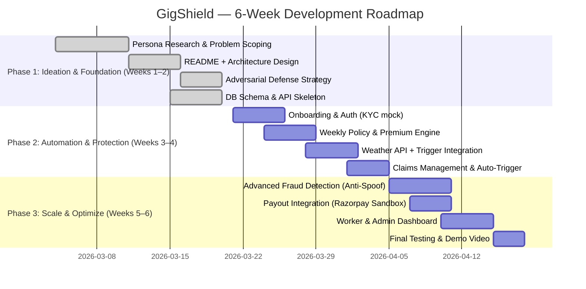

<div align="center">

# 🛡️ GigShield

### AI-Powered Parametric Income Insurance for Grocery/Q-Commerce Delivery Partners

**When the streets flood, GigShield pays. When fraud rings attack, GigShield fights back smarter.**

[]()
[]()
[]()

</div>

---

> **GigShield is an AI-powered, zero-touch parametric insurance platform that automatically protects Q-Commerce delivery partners from income loss caused by extreme weather, pollution, and civic disruptions — with weekly micro-premiums, instant payouts, and a multi-layered anti-spoofing defense that catches fraud rings before they drain a single rupee.**

---

## 📖 Project Overview

### What is GigShield?

GigShield is an **AI-enabled parametric insurance platform** purpose-built for India's Q-Commerce (quick-commerce) grocery delivery partners — the riders powering 10-minute delivery for platforms like **Zepto, Blinkit, and Swiggy Instamart**.

These workers operate in a hyper-local, high-frequency delivery model where external disruptions — sudden rain, waterlogging, extreme heat, pollution spikes, curfews, or zone closures — can **wipe out 40–60% of daily earnings instantly**. Unlike salaried employees, they have **zero income protection** when these events occur. They bear the full financial loss with no safety net.

### Why does GigShield exist?

India's gig delivery workforce exceeds **7.5 million workers**, yet not a single product exists to insure their **income** (not health, not vehicles — just the wages they lose when the world stops them from working). GigShield fills this gap with:

- **Parametric automation** — claims trigger automatically when measurable disruption thresholds are crossed
- **Weekly micro-premiums** — ₹29–₹79/week, aligned with how gig workers earn
- **AI-powered fraud defense** — a multi-signal trust engine that stops GPS-spoofing syndicates without penalizing honest workers
- **Zero-touch claims** — no paperwork, no phone calls, no delays

### Alignment with the Problem Statement

| Requirement | GigShield's Approach |
|---|---|
| Income loss coverage only | ✅ Strictly excludes health, life, accident, and vehicle repair |
| Weekly pricing model | ✅ Premiums calculated and deducted weekly via UPI |
| AI-powered risk assessment | ✅ XGBoost-based dynamic premium calculation |
| Intelligent fraud detection | ✅ Multi-signal Trust Score Engine + ring detection |
| Parametric automation | ✅ Real-time trigger monitoring with auto-payout |
| Integration capabilities | ✅ Weather, AQI, traffic, platform APIs (free-tier/mock) |

### Alignment with the Market Shift

The **Market Crash threat** — a syndicate of 500 delivery workers using GPS-spoofing apps to drain the liquidity pool — is addressed through a dedicated **Adversarial Defense & Anti-Spoofing Strategy** (Section 7) that renders simple GPS verification obsolete and replaces it with multi-layered behavioral, environmental, and device-level intelligence.

---

## 👤 Personas & User Journeys

### Primary Persona: Arjun, Zepto Delivery Partner

| Attribute | Detail |
|---|---|
| **Age** | 24 |
| **City** | Chennai |
| **Platform** | Zepto |
| **Daily Earnings** | ₹900–₹1,200 (₹25–₹40/order + surge + milestones) |
| **Weekly Earnings** | ₹5,500–₹7,000 (6-day work week) |
| **Device** | Redmi Note 12 (Android, 4G) |
| **Vehicle** | Hero Splendor |
| **Daily Orders** | 35–45 (hyper-local 10-min deliveries) |
| **Payment** | UPI (weekly settlement from Zepto) |
| **Pain Point** | Lives week-to-week; one heavy rain day = ₹1,100+ income loss with no safety net |

### Persona-Based Scenarios

#### Scenario A — Monsoon Waterlogging
> Chennai receives 80mm rainfall in 3 hours. Roads in Arjun's zone are waterlogged. Zepto pauses all dispatches from his dark store. GigShield's weather API detects the disruption, verifies Arjun's location against the alert zone, and auto-credits **₹1,100 to his UPI within 30 minutes**. Arjun takes no action — the system handles everything.

#### Scenario B — Severe Pollution Red Alert
> AQI hits 420 in Arjun's operating zone. Zepto triggers an outdoor delivery pause. GigShield cross-references the CPCB AQI threshold breach with Zepto's platform status and initiates a **partial payout of ₹950** for the lost shift hours.

#### Scenario C — Flash Strike / Zone Closure
> A delivery union calls a flash protest, blocking 3 dark stores in Arjun's zone for 4 hours. GigShield detects the closure via its news/social disruption feed, validates the 30%+ store shutdown in the geo-fence, and queues a **₹800 payout** automatically.

### Complete Application Workflow



### Claim Lifecycle (Zero-Touch Flow)



---

## 💸 Weekly Premium Model

### Why Weekly Pricing?

Gig workers earn and spend **week-to-week**. A monthly premium creates cash-flow friction and reduces adoption. A weekly micro-premium:

- Matches the natural payout cycle of Q-Commerce platforms
- Feels affordable (₹29–₹79/week vs. ₹200+/month)
- Increases adoption and retention (auto-renew weekly)
- Reduces lapse risk — workers re-subscribe naturally with each payout

### Premium Plans

| Plan | Weekly Premium | Max Weekly Payout | Best For |
|------|---------------|-------------------|----------|
| **Lite** | ₹29 | ₹400 | Part-time riders (3–4 days/week) |
| **Standard** | ₹49 | ₹750 | Full-time riders (6 days/week) |
| **Pro** | ₹79 | ₹1,200 | High-earning riders in high-risk zones |

### Dynamic Premium Calculation

```
Weekly Premium = Base Rate × Zone Risk Multiplier × Worker Risk Adjustment × Disruption Exposure Factor
```

| Component | What It Measures | Example |
|---|---|---|
| **Base Rate** | Administrative + pool contribution | ₹49 (Standard) |
| **Zone Risk Multiplier** | Flood/heat/pollution history of the worker's zone | 0.8 (safe zone) → 1.5 (flood-prone) |
| **Worker Risk Adjustment** | Tenure, claim history, reliability score | 0.95 (loyal, clean history) → 1.1 (new worker) |
| **Disruption Exposure Factor** | Upcoming 7-day weather forecast severity | 1.0 (clear week) → 1.3 (monsoon forecast) |

**Example for Arjun:**
- Normal week: ₹49 × 1.0 × 0.95 × 1.0 = **₹47**
- Monsoon week forecast: ₹49 × 1.3 × 0.95 × 1.2 = **₹73**
- Safe zone + clean history: ₹49 × 0.8 × 0.90 × 1.0 = **₹35** (loyalty discount)

### Parametric Triggers

All triggers are **geo-fenced to the worker's registered delivery zone**. Payouts are proportional to hours of income lost.

| Trigger | Data Source | Threshold | Payout % |
|---------|-----------|-----------|----------|
| Heavy Rain / Red Alert | IMD API + OpenWeatherMap | Rainfall > 64.5mm/24hr OR Red Alert | 100% |
| Waterlogging / Flood | NDMA Alerts (mock) | Zone flagged as flooded | 100% |
| Extreme Heat Advisory | IMD API | Temperature > 44°C + heat advisory | 75% |
| Severe Pollution | CPCB AQI API | AQI > 400 | 50% |
| Curfew / Hartal | News NLP + Govt. alerts (mock) | Verified curfew in operational zone | 100% |
| Zone / Store Closure | Platform API (simulated) | > 30% dark-store closures in zone OR "No Dispatch" > 3 hrs | 80% |

### Payout Formula

```
Payout = Hours Lost × Estimated Hourly Wage × Payout Percentage (capped at plan max)
```

Example: Arjun earns ~₹150/hr → 4 hours lost in Red Alert rain → 4 × ₹150 × 100% = **₹600** (within Standard plan cap of ₹750).



---

## 📱 Platform Choice: Mobile-First PWA

### Chosen: Progressive Web App (PWA) for Workers + Web Dashboard for Admins

| Factor | PWA Advantage |
|--------|---------------|
| **Device reality** | 90%+ of delivery partners use low-end Android — PWA avoids the 60–80 MB Play Store install barrier |
| **Distribution** | Shareable via WhatsApp link or QR code at dark-store pickup points — grassroots adoption |
| **Offline support** | Service workers provide offline access to policy status and claim history |
| **Push notifications** | Web Push API handles real-time claim alerts and disruption warnings |
| **Payment integration** | UPI deep links work natively on Android without a native SDK |
| **Cost efficiency** | Single codebase, faster to develop and iterate during the hackathon |

**Admin Dashboard:** A full web dashboard (React) for insurer ops teams to monitor policies, review flagged claims, track loss ratios, and observe risk heatmaps.

---

## 🧠 AI/ML Integration Strategy

GigShield uses AI/ML across **three distinct layers** — each serving a different function with clearly defined intelligence boundaries.

### Layer Architecture



### What Is Intelligent vs. Rule-Based

| Function | Approach | Why |
|---|---|---|
| **Premium Calculation** | ML (XGBoost Regressor) | Requires learning from non-linear interactions between zone risk, weather patterns, and worker behavior |
| **Trigger Detection** | Rule Engine (deterministic) | Parametric triggers must be transparent, auditable, and predictable — no ML ambiguity |
| **Fraud Detection** | Hybrid (Isolation Forest + LSTM + Rules) | Anomaly detection requires ML to catch novel patterns; rules provide guardrails |
| **Ring Detection** | Graph Clustering (DBSCAN) + Rules | Coordinated fraud requires relationship-aware analysis beyond individual claims |
| **Liquidity Forecasting** | Time-Series ML (Prophet) | Predicts next-week claims exposure for reserve management |

### Detailed Model Breakdown

#### A. Premium Calculation — XGBoost Regressor
- **Inputs:** Zone flood/heat history, seasonal risk index, worker tenure, 7-day weather forecast, historical claim frequency
- **Output:** Worker-specific weekly premium within the plan band
- **Retraining:** Weekly on new weather and claim data

#### B. Fraud Detection — Isolation Forest + LSTM
- **Isolation Forest:** Detects point-in-time behavioral anomalies at claim moment (location, sensor, timing)
- **LSTM:** Analyses worker movement sequences over the past 7 days to flag trajectory inconsistencies
- **Output:** Fraud probability score (0–1); score > 0.75 routes to manual review

#### C. Predictive Liquidity Management — Prophet
- **Input:** Historical payout data, upcoming weather forecasts, seasonal disruption patterns
- **Output:** Expected total claims for next week → advised liquid cash reserve
- **Purpose:** Prevents fund exhaustion even during high-disruption weeks

---

## 🚨 Adversarial Defense & Anti-Spoofing Strategy

> **Market Crash Context:** A sophisticated syndicate of 500 delivery workers in a tier-1 city used GPS-spoofing apps to fake locations inside Red Alert weather zones while resting at home, triggering mass false payouts and draining the liquidity pool. **Simple GPS verification is officially obsolete.**

### A. The Differentiation: Genuine Worker vs. GPS Spoofer

No single data point approves a claim. Every claim passes through a **multi-signal Trust Score Engine** that cross-references claimed location against **physical reality**.

The core insight: **spoofing apps only fake the software GPS location. They cannot fake the physical realities of being outdoors in a storm.**

| Signal | Genuine Stranded Worker | GPS Spoofer at Home |
|--------|------------------------|---------------------|
| **Cell Tower ID** | Matches GPS zone tower | Often mismatches claimed GPS location |
| **GPS Accuracy (HDOP)** | Degraded — storms disrupt satellite signal | Suspiciously perfect (±1m) — spoofing artifact |
| **Accelerometer/Gyroscope** | Sheltering-in-place micro-vibrations, walking, bike engine idle | Dead-flat XYZ axis — phone on desk/couch |
| **Wi-Fi SSID Scan** | Public/commercial networks or none (outdoor) | Matches historical home Wi-Fi cluster |
| **Battery State** | Discharging (outdoor GPS + screen use) | Charging or stable (home indicator) |
| **Battery Thermal Profile** | Elevated — active GPS + navigation drains heat | Cool — spoofing in background uses minimal power |
| **Platform App Status** | Online, 0 orders (platform paused deliveries) | App offline or no recent login for hours |
| **Historical Location** | Consistent with usual delivery zone | No prior activity in claimed zone |

All signals feed a **weighted ensemble model** producing a **Trust Score (0–1)**:

| Trust Score | Action |
|---|---|
| **≥ 0.80** | ✅ Auto-approve and instant payout |
| **0.50–0.79** | 🔍 Soft review — worker prompted for one confirmatory signal |
| **< 0.50** | 🚫 Rejected and flagged for ops review |

> **Critical design decision:** Absent or degraded GPS during a confirmed storm event is treated as a **positive indicator**, not a fraud signal. In a verified disaster zone, missing clean GPS signal *supports* the worker's claim — because real storms degrade GPS, while spoofing apps produce suspiciously perfect coordinates.

### B. The Data: Beyond GPS

The defense layer ingests **8 categories of evidence** that GPS-spoofing apps cannot fake:

| Data Category | Specific Signals | Why It Defeats Spoofing |
|---|---|---|
| **Device Sensor Telemetry** | Accelerometer, gyroscope, magnetometer readings | A phone on a desk shows flat XYZ; a phone on a bike in rain shows micro-vibrations |
| **Battery Forensics** | Discharge rate, thermal profile, charging state | Real outdoor GPS use spikes battery temp; spoofing at home stays cool and charging |
| **Network Fingerprinting** | Wi-Fi BSSIDs, cell tower IDs, signal strength | If 50 "stranded" workers share the same home Wi-Fi BSSID, they're in one room |
| **Connectivity Patterns** | Network latency, signal drops, handover frequency | Real storm conditions cause signal degradation; spoofing from home shows stable 4G |
| **Route History Consistency** | Historical delivery routes, zone familiarity | Workers claiming disruption in zones they've never operated in are flagged |
| **Weather API Correlation** | Cross-reference claimed location with real-time weather data | If no weather event exists at the claimed coordinates, the claim is invalid |
| **Platform Activity Signals** | Order attempt logs, app foreground time, last active timestamp | Workers who were offline before the alert weren't working — can't be "stranded" |
| **Session Behavior** | App usage patterns, screen interaction, notification response | Genuine workers interact with the app naturally; bots/scripts show mechanical patterns |

### C. The Detection Logic: Catching Coordinated Fraud Rings

Individual spoofing is relatively simple to catch. The harder problem is **coordinated rings** — 500 accounts acting in concert via Telegram groups. GigShield uses a dedicated **Ring Detection Algorithm**:



**Key Ring Detection Signals:**

1. **Timestamp Clustering (DBSCAN):** 500 legitimate workers naturally spread claim submissions over 30–60 minutes as they individually notice the disruption. A fraud ring coordinating via Telegram produces a claim burst within 2 minutes — a clear statistical outlier.

2. **GPS Coordinate Quantization:** Spoofing apps produce suspiciously round GPS values (e.g., exactly 13.082700° N, 80.270700° E). Real GPS under storm conditions produces noisy, fluctuating values with variable precision.

3. **Social Graph Heuristics:** Devices with shared contact book overlaps, linked UPI payout accounts, or accounts batch-registered within the same 24-hour window are soft-linked. A cluster of soft-linked accounts all claiming simultaneously is a **hard ring signal**.

4. **Platform Activity Mismatch:** If the platform API shows these workers were offline before the weather alert, they were not actively working — and therefore cannot be "stranded while delivering."

### D. The UX Balance: Protecting Honest Workers

GigShield applies a **"Strict on fraud, humane with stranded workers"** philosophy. The system never shows a "Fraud Detected" error to any worker.



**Worker-Friendly Safeguards:**

| Safeguard | How It Works |
|---|---|
| **Soft flags, not hard blocks** | Workers scoring 0.50–0.79 receive a friendly push notification in their language: *"We're verifying your claim — please send one photo from where you are."* They have 6 hours to respond. |
| **Zone-level confidence boost** | If > 70% of workers in a zone are auto-approved (confirming a real event), remaining flagged workers in the same zone receive a trust score uplift. |
| **Network Drop Exception** | Workers in areas historically known for poor connectivity (mapped via crowdsourced data) get sensor signals (accelerometer, battery) weighted higher than GPS — because GPS glitches first in bad weather, but the phone's accelerometer still detects the rider walking their bike through a puddle. |
| **Appeal window** | Any rejected claim can be appealed with a voice note or photo within 48 hours, reviewed by a human ops agent within 24 hours. |
| **Trusted Worker status** | Workers with 8+ weeks of clean history get a raised trust score floor (e.g., minimum 0.60), reducing false positives for long-term honest users. |
| **80% immediate payout on soft flag** | Even soft-flagged workers receive 80% of the payout immediately; the remaining 20% is released after verification passes. |

### E. System Resilience Under Adversarial Conditions

| Threat | Defense |
|---|---|
| **Mass exploitation (500+ simultaneous spoofed claims)** | Ring Detection Algorithm freezes the entire cluster within seconds; individual legitimate workers are triaged and paid within 4 hours |
| **Liquidity pool draining** | Prophet-based forecasting pre-allocates reserves; ring-held payouts are not released until verified, protecting the pool |
| **Evolving spoofing techniques** | Confirmed fraud cases feed back into the ML model weekly (active learning); new spoofing patterns are detected faster over time |
| **Coordinated Telegram group attacks** | Social graph analysis detects accounts linked by contact overlap, batch registration, and shared UPI history |
| **Bot-generated fake accounts** | Device fingerprinting, CAPTCHA on registration, and behavioral analysis during onboarding detect non-human patterns |

**Scalability principle:** The Trust Score Engine and Ring Detection Algorithm operate as **stateless, horizontally-scalable microservices**. A burst of 10,000 claims processes identically to a burst of 100 — the system does not degrade under adversarial load.

---

## 🏗️ System Architecture



### Architectural Principles

| Principle | Implementation |
|---|---|
| **Separation of concerns** | Rule engine for deterministic triggers; ML layer for risk and fraud scoring |
| **Modular microservices** | Each core function (premium, trigger, fraud, payout) is an independent service |
| **Event-driven monitoring** | Trigger engine polls external APIs at configurable intervals; fires events on threshold breach |
| **Mock-first development** | All external integrations use free-tier or mock APIs in Phases 1–2; swappable for production |
| **Horizontal scalability** | Stateless services behind an API gateway; Redis handles ephemeral state |

---

## 🛠️ Tech Stack

| Layer | Technology | Justification |
|-------|-----------|---------------|
| **Frontend (Worker)** | React 18 + Vite (PWA) | Lightweight, offline-capable, no app store dependency |
| **Frontend (Admin)** | React 18 + Vite | Full dashboard with analytics, charts, and review queues |
| **Backend API** | FastAPI (Python) | High-performance async API; native Python for seamless ML integration |
| **ML/AI** | scikit-learn, XGBoost, TensorFlow Lite | XGBoost for premium; Isolation Forest for anomaly detection; TFLite for on-device checks |
| **Task Queue** | Celery + Redis | Async trigger monitoring and batch fraud scoring |
| **Database** | PostgreSQL | Relational data: users, policies, claims, payouts |
| **Cache** | Redis | Trigger state, session management, rate limiting |
| **Auth** | Firebase Auth (Phone OTP) | Delivery partners authenticate via phone number — no email/password friction |
| **Payments** | Razorpay Sandbox (UPI test mode) | Simulated UPI payouts for demo; production-ready SDK |
| **Weather** | IMD API + OpenWeatherMap (free tier) | Primary + fallback weather data sources |
| **AQI** | CPCB API / WAQI | Real-time pollution monitoring |
| **Maps/Geo-fencing** | OpenStreetMap / Leaflet | Zone definition and geo-fence matching |
| **Deployment** | Docker + Render | Containerized services; free-tier cloud hosting for hackathon |
| **Version Control** | GitHub | Single repository for all phases |

---

## 📅 Development Plan



### Phase Deliverables

| Phase | Deadline | Key Deliverables |
|-------|----------|-----------------|
| **Phase 1** | March 20 (EOD) | README (this document), GitHub repo, Figma prototype, 2-min strategy video |
| **Phase 2** | April 4 | Registration, policy management, dynamic premium calculator, claims engine, mock trigger integration, 2-min demo video |
| **Phase 3** | April 17 | Advanced fraud detection, simulated instant payouts, intelligent dashboards (worker + admin), 5-min final demo video, pitch deck |

---

## 🏅 Key Differentiators

| Differentiator | Why It Matters |
|---|---|
| **Q-Commerce-exclusive focus** | Tailored for the unique risk profile of 10-minute grocery delivery — not a generic gig-worker product |
| **Multi-signal Trust Score Engine** | Goes far beyond GPS — uses sensor telemetry, battery forensics, Wi-Fi fingerprinting, and network patterns to verify claims |
| **Ring Detection at scale** | DBSCAN clustering + social graph analysis catches coordinated fraud rings, not just individual spoofers |
| **Worker-humane UX** | Soft flags, grace periods, zone-level confidence boosts, and appeal windows ensure honest workers are never unfairly penalized |
| **Inverted GPS logic** | Degraded GPS in a confirmed storm is treated as a *positive* indicator — a counterintuitive but correct design decision that spoofers can't exploit |
| **Zero-touch parametric claims** | No paperwork, no phone calls — disruption detected → claim initiated → payout credited automatically |
| **Weekly micro-premiums** | ₹29–₹79/week aligns perfectly with gig-worker cash flow — high adoption, low lapse |
| **Predictive liquidity management** | Prophet-based forecasting ensures the payout pool is never caught underfunded during high-disruption weeks |

---

## 📊 Analytics & Dashboards

### Worker Dashboard
- Active weekly coverage status and plan details
- Premium paid / due this week
- Real-time disruption alerts in the worker's zone
- Claim status tracker (initiated → verified → paid)
- Historical payout summary: "₹4,200 protected this month"

### Admin Dashboard
- Weekly policy volume and activation rate
- Loss ratio tracking and trend analysis
- Claim frequency heatmap by zone
- Fraud score distribution and ring alerts
- Manual review queue with Trust Score breakdown
- Predictive analytics: next-week disruption exposure forecast
- Geographic risk heatmaps

---

## 🔮 Future Scope

| Feature | Timeline | Description |
|---|---|---|
| **Multi-persona expansion** | Post-hackathon | Extend to food delivery (Zomato/Swiggy) and e-commerce (Amazon/Flipkart) personas |
| **On-device ML** | Phase 3+ | TensorFlow Lite models running on the worker's phone for real-time sensor analysis without server round-trips |
| **Regional language support** | Phase 3 | Push notifications-and-onboarding in Tamil, Hindi, Telugu, Kannada |
| **UPI AutoPay live integration** | Production | Replace Razorpay sandbox with live UPI mandate for real premium collection |
| **Reinsurance marketplace** | Long-term | Connect parametric policies to reinsurance partners for portfolio risk distribution |
| **Community trust network** | Long-term | Workers who consistently pass verification build reputation scores that unlock lower premiums |

---

## ⚠️ Risks & Mitigations

| Risk | Likelihood | Mitigation |
|------|-----------|------------|
| Weather API downtime | Medium | Dual-source (IMD + OpenWeatherMap); cached last-known state in Redis |
| ML model drift | Medium | Weekly retraining on fresh weather + claims data; monitoring for accuracy degradation |
| Worker adoption resistance | Medium | Ultra-simple onboarding (< 2 min); WhatsApp distribution; vernacular language support |
| Evolving spoofing techniques | High | Active learning pipeline — confirmed fraud feeds back into model weekly |
| Liquidity shortfall during mass events | Low | Prophet-based reserve forecasting; ring-held payouts protect the pool |

### Assumptions
- Workers have Android smartphones with GPS, accelerometer, and internet connectivity
- Weather and AQI APIs provide reliable zone-level data (free-tier/mock acceptable)
- Platform APIs (Zepto/Blinkit) can be simulated for hackathon purposes
- UPI payment infrastructure is available via sandbox/test mode

---

## 📈 Success Metrics

| Metric | Target |
|---|---|
| Onboarding completion rate | > 85% |
| Weekly policy activation rate | > 70% of registered workers |
| Trigger detection accuracy | > 95% (measured against verified weather events) |
| Claim auto-approval rate (genuine claims) | > 80% |
| Fraud ring detection precision | > 90% |
| False positive rate (honest workers flagged) | < 5% |
| Payout turnaround (auto-approved) | < 30 minutes |
| Manual review turnaround | < 24 hours |

---

## 👥 Built By — Team DevGodz

**Guidewire DEVTrails 2026 — Phase 1 Submission**

> We are **DevGodz** — a team of engineers, designers, and problem-solvers building financial safety nets for the workers who power India's 10-minute delivery revolution. When the streets flood and the app goes dark, DevGodz makes sure the rider doesn't go home empty-handed.

---

## 🔗 Links

| Resource | Link |
|----------|------|
| **Demo Video (2-min)** | [https://drive.google.com/drive/folders/1mUh3e1g5_D2iPK3s0-t4NgtCyY4PbVQE?usp=drive_link] |

---

<div align="center">

**GigShield** | Protecting incomes, not just deliveries.

*Built with 🛡️ by Team DevGodz for Guidewire DEVTrails 2026*

</div>
