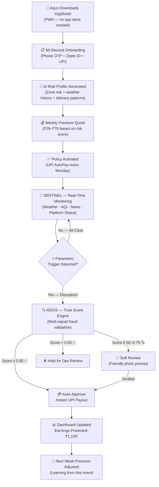
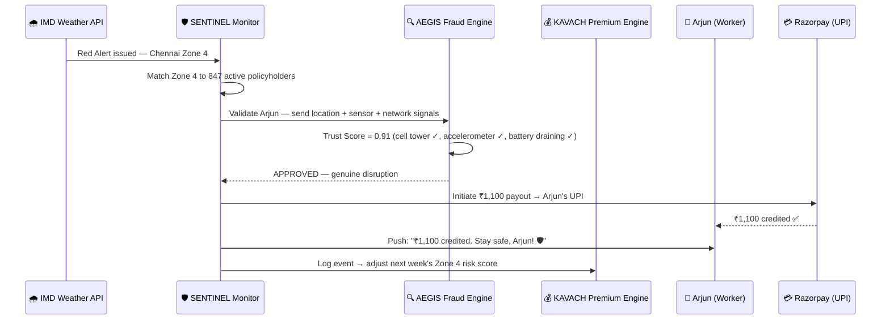
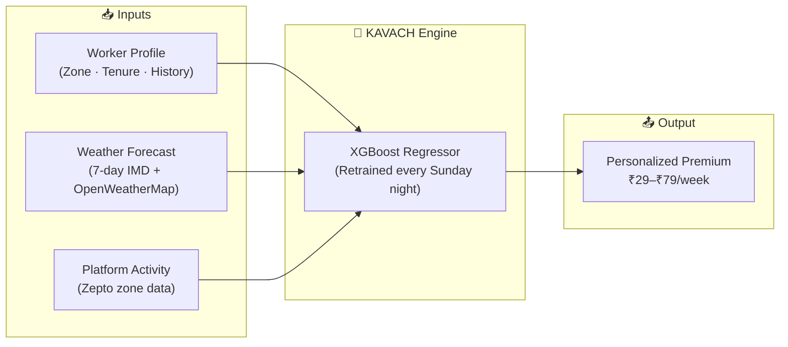
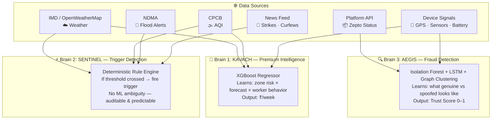
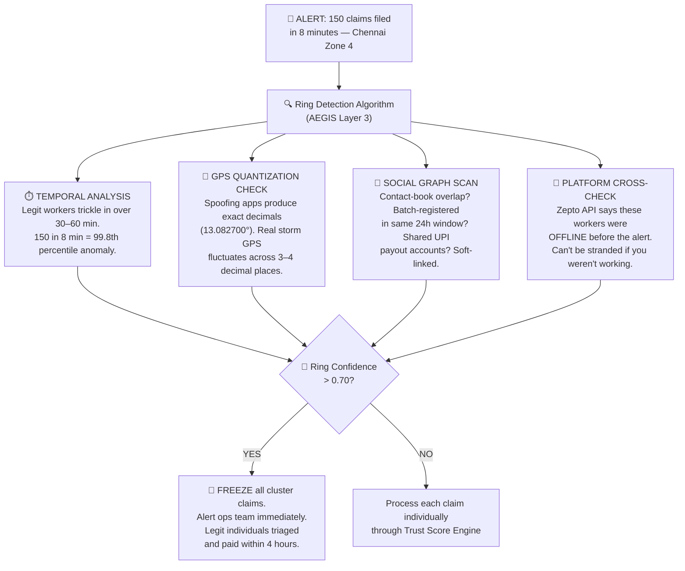
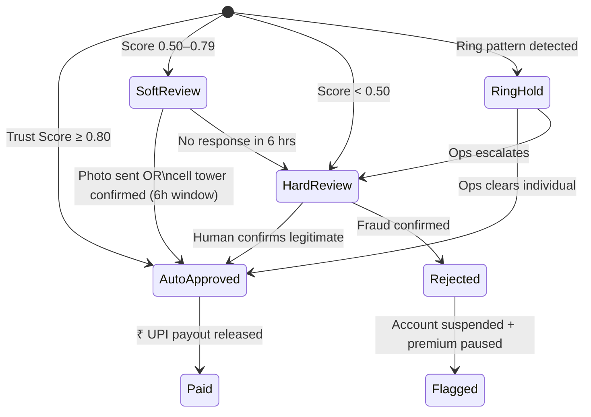
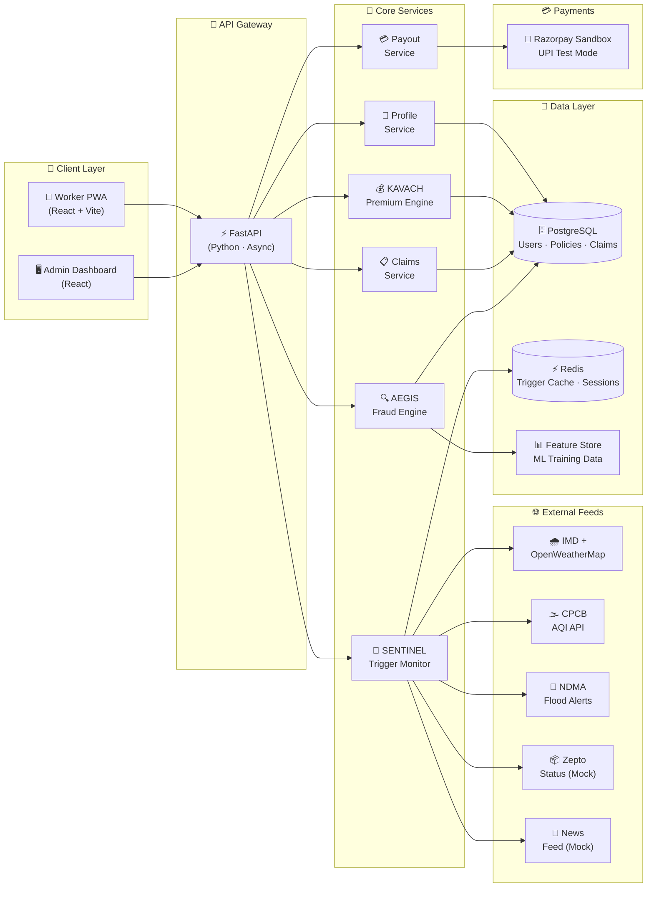
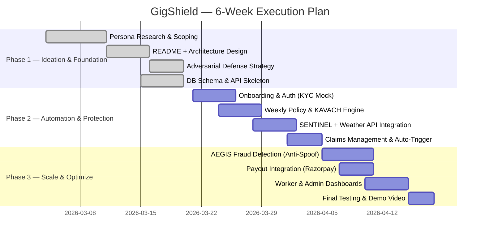

<div align="center">


# GigShield

### *The AI-Powered Safety Net That Pays When the Streets Don't*

**Parametric Income Insurance for India's Q-Commerce Delivery Partners**

> 📋 **Phase 1 — Ideation & Foundation** | This README is our idea document for the Guidewire DEVTrails 2026 hackathon. It presents our proposed architecture, strategy, and technical design. Code implementation follows in Phases 2 & 3.

<br/>

[](https://devtrails.guidewire.com)
[]()
[]()
[]()

---

**`Zero paperwork`** · **`Zero phone calls`** · **`Zero delays`**

*Disruption detected → Claim auto-triggered → ₹ credited to UPI — that's the vision*

</div>

---

## 📑 Table of Contents

- [The Problem — In 30 Seconds](#-the-problem--in-30-seconds)
- [What is GigShield?](#-what-is-gigshield)
- [Meet Arjun — Our User](#-meet-arjun--our-user)
- [How It Works — The GigShield Journey](#-how-it-works--the-gigshield-journey)
- [Weekly Premium Model — Project Kavach](#-weekly-premium-model--project-kavach)
- [Platform Choice — Why a PWA?](#-platform-choice--why-a-pwa)
- [AI/ML — The Three Brains of GigShield](#-aiml--the-three-brains-of-gigshield)
- [Adversarial Defense & Anti-Spoofing Strategy](#-adversarial-defense--anti-spoofing-strategy)
- [System Architecture — The Blueprint](#-system-architecture--the-blueprint)
- [Tech Stack](#-tech-stack)
- [Development Roadmap](#-development-roadmap)
- [What Makes Us Different](#-what-makes-us-different)
- [Dashboards & Analytics](#-dashboards--analytics)
- [Risks, Assumptions & Future Vision](#-risks-assumptions--future-vision)
- [Built By — Team DevGodz](#-built-by--team-devgodz)

---

## 💥 The Problem — In 30 Seconds

> **It's 2 PM in Chennai. The sky cracks open. 80mm of rain in 3 hours.**
>
> Arjun — a 24-year-old Zepto delivery rider — watches the roads flood from under a tea-stall awning. He can't ride. He can't deliver. He can't earn. The Zepto app goes grey: *"Deliveries paused in your area."*
>
> By evening, Arjun has lost **₹1,100** — nearly half his daily wage. Tomorrow, his rent is due. He has no insurance, no safety net, no one to call. He just... absorbs the loss.
>
> **This happens to 7.5 million gig workers across India. Every monsoon. Every heatwave. Every sudden curfew.**
>
> They are the invisible backbone of India's 10-minute economy. And when the world stops them from working, they earn **nothing**.

### The Hard Numbers

| Stat | Reality |
|---|---|
| Gig workers in India | **7.5 million+** delivery partners |
| Income loss during disruptions | **20–30% of monthly earnings** |
| Existing income protection products | **Zero** |
| Average daily loss during Chennai monsoon day | **₹1,100** per rider |
| Recovery mechanism available | **None** — they absorb the loss entirely |

### What GigShield Does NOT Cover

> [!IMPORTANT]
> GigShield strictly **excludes** health insurance, life insurance, accident coverage, and vehicle repair. We insure **one thing only**: the income a delivery partner loses when external disruptions stop them from working.

---

## 🛡️ What is GigShield?

**GigShield** is a proposed AI-powered **parametric insurance platform** designed to automatically detect when external disruptions halt Q-Commerce deliveries and **pay the worker's lost wages directly to their UPI** — without a single form, phone call, or approval chain.

### The Three Promises

| Promise | How We Deliver |
|---|---|
| 🎯 **"I'll protect your income"** | Weekly micro-premiums (₹29–₹79) with automatic coverage for weather, pollution, strikes, and zone closures |
| ⚡ **"I'll pay you instantly"** | Parametric triggers fire automatically; payouts reach UPI in under 30 minutes |
| 🤝 **"I'll never call you a liar"** | Multi-signal Trust Score Engine verifies claims without punishing honest workers |

### Why Parametric?

Traditional insurance: *"Something bad happened? Prove it. Fill forms. Wait 45 days. Maybe we'll pay."*

**Parametric insurance: *"Rain crossed 64.5mm in your zone? You're covered. ₹1,100 sent. Stay safe."***

No claims filing. No adjuster visits. No ambiguity. If the measurable threshold is crossed, the payout is **automatic and guaranteed**.

---

## 👤 Meet Arjun — Our User

<div align="center">

*Every design decision in GigShield is made for Arjun.*

</div>

| | Detail |
|---|---|
| **Name** | Arjun Kumar |
| **Age** | 24 |
| **City** | Chennai (Korattur → Anna Nagar zone) |
| **Platform** | Zepto (Q-Commerce, 10-min grocery delivery) |
| **Daily Earnings** | ₹900–₹1,200 (₹25–₹40/order + surge + milestones) |
| **Weekly Earnings** | ₹5,500–₹7,000 (6-day week) |
| **Device** | Redmi Note 12 (Android, 4G, limited storage) |
| **Vehicle** | Hero Splendor (two-wheeler) |
| **Orders/Day** | 35–45 hyper-local runs |
| **Payment** | UPI weekly settlement from Zepto |
| **Biggest Fear** | *Not illness or accidents — but a sudden thunderstorm that stops him from earning for 4 hours and costs him half his daily wage* |

### Three Days That Changed Arjun's Month

#### 🌧️ Day 1: The Monsoon Hit

> *March 12, 2:14 PM.* Chennai's Korattur zone receives 80mm rainfall in 3 hours. Streets flood ankle-deep. Zepto pauses all dispatches from Arjun's dark store.
>
> **Without GigShield:** Arjun loses ₹1,100. He texts his roommate: *"Rent short this week."*
>
> **With GigShield (proposed flow):** At 2:16 PM, SENTINEL detects IMD Red Alert in Zone 4. At 2:17 PM, AEGIS validates Arjun's location (cell tower match, phone discharging, accelerometer shows sheltering-in-place). At 2:19 PM, **₹1,100 hits Arjun's UPI.** He gets a push notification: *"₹1,100 credited. Stay safe, Arjun. 🛡️"*
>
> **Target: disruption to payout in under 5 minutes.**

#### 🌫️ Day 2: The Pollution Spike

> *March 15, 7:30 AM.* AQI hits 420 in Anna Nagar. Zepto flags outdoor delivery pause. Arjun can't ride.
>
> **With GigShield (proposed flow):** CPCB AQI breach + Zepto "No Dispatch" flag triggers a partial payout. **₹950 credited** for the lost morning shift. Arjun uses the time to service his bike instead of stressing about rent.

#### ⛔ Day 3: The Flash Strike

> *March 18, 11:00 AM.* A delivery union calls a flash protest. Three dark stores in Arjun's zone shut down for 4 hours. No pickups possible.
>
> **With GigShield (proposed flow):** News/social disruption feed detects the closure. 30%+ store shutdown in geo-fence confirmed. **₹800 queued and paid** for the affected hours.

---

## 🔄 How It Works — The GigShield Journey

### The Proposed Workflow



> [!NOTE]
> **Named Systems:**
> - **SENTINEL** = Real-time disruption monitoring engine (weather + AQI + news + platform feeds)
> - **AEGIS** = Multi-signal Trust Score Engine (fraud detection + claim validation)
> - **KAVACH** = Dynamic premium calculation model (weekly pricing intelligence)

### Proposed Claim Lifecycle — Zero Human Intervention



---

## 💸 Weekly Premium Model — Project KAVACH

> *Named after the Hindi word for "armor" — because that's what a good premium model should feel like.*

### Why Weekly? Because Arjun Earns Weekly.

Monthly premiums don't work for gig workers. They live paycheck to paycheck — or rather, **payout to payout**. Zepto settles weekly. Arjun budgets weekly. His insurance must work the same way.

| Weekly Advantage | Why It Matters |
|---|---|
| **Matches earnings cycle** | Premium auto-deducted on Monday, aligned with Zepto's payout day |
| **Micro-sized, macro-impact** | ₹29–₹79/week feels trivial — less than the cost of two chai breaks |
| **Low lapse risk** | Auto-renew weekly; no annual renewal friction |
| **Dynamic adjustment** | Premium adapts every week based on forecast risk — not locked for 12 months |

### The Three Plans

| Plan | Weekly Premium | Max Payout/Week | Coverage Hours | Best For |
|------|:---:|:---:|:---:|---|
| 🥉 **Lite** | ₹29 | ₹400 | Up to 3 hrs | Part-timers (3–4 days/week) |
| 🥈 **Standard** | ₹49 | ₹750 | Up to 5 hrs | Full-timers (6 days/week) |
| 🥇 **Pro** | ₹79 | ₹1,200 | Up to 8 hrs | High-earners in high-risk zones |

### How KAVACH Calculates Your Premium

```
Weekly Premium = Base Rate × Zone Risk × Worker Adjustment × Forecast Factor
```

| Component | What It Learns From | Range |
|---|---|---|
| **Base Rate** | Plan tier (Lite/Standard/Pro) | ₹29 / ₹49 / ₹79 |
| **Zone Risk Multiplier** | Historical flood, heat, AQI data for the worker's operating zone | 0.7× (safe) → 1.6× (flood-prone) |
| **Worker Adjustment** | Tenure, clean-claim history, reliability signals | 0.85× (trusted veteran) → 1.15× (new joiner) |
| **Forecast Factor** | ML-predicted disruption probability for the upcoming 7 days | 1.0× (clear skies) → 1.4× (monsoon incoming) |

#### Arjun's Premium in Three Scenarios

| Week Context | Calculation | Arjun Pays |
|---|---|---|
| ☀️ Clear week, safe zone, 12-week clean history | ₹49 × 0.9 × 0.85 × 1.0 | **₹37** |
| 🌦️ Normal week, moderate zone | ₹49 × 1.0 × 0.95 × 1.0 | **₹47** |
| 🌧️ Monsoon forecast, flood-prone zone | ₹49 × 1.4 × 0.95 × 1.3 | **₹85** *(auto-upgraded to Pro coverage cap)* |

### Parametric Triggers — What Fires a Claim

Every trigger must be **measurable, verifiable, and geo-fenced** to the worker's registered delivery zone. No subjective judgment — if the threshold crosses, the system pays.

| Trigger | Source | Threshold | Payout % |
|---|---|---|:---:|
| 🌧️ Heavy Rain | IMD API + OpenWeatherMap | ≥ 64.5mm/24hr (IMD "Heavy" classification) | 100% |
| 🌧️🔴 Extremely Heavy Rain / Red Alert | IMD API | ≥ 204.5mm/24hr OR IMD Red Alert issued | 100% |
| 🌊 Waterlogging / Flood | NDMA Alerts (mock) | Zone flagged as flooded | 100% |
| 🔥 Extreme Heat | IMD API | > 44°C + heat advisory | 75% |
| 🌫️ Severe Pollution | CPCB AQI API | AQI ≥ 401 (CPCB "Severe" category) | 50% |
| 🚫 Curfew / Hartal | News NLP + Govt. feeds (mock) | Verified curfew/strike in zone | 100% |
| 🏪 Zone / Dark-Store Closure | Platform API (simulated) | > 30% store closures OR "No Dispatch" > 3h | 80% |

**Payout formula:**
```
Payout = Hours Lost × ₹150/hr (estimated hourly wage) × Payout% — capped at plan ceiling
```



---

## 📱 Platform Choice — Why a PWA?

> *We asked ourselves: "Would Arjun install a 70MB app from the Play Store while on a delivery break?" The answer was obvious.*

**Chosen: Progressive Web App (PWA)** for workers + **React Web Dashboard** for admin/ops.

| Factor | Why PWA Wins |
|---|---|
| 📦 **Zero install friction** | 90%+ of riders use budget Android phones with 32–64 GB storage already packed with Zepto, WhatsApp, and UPI apps. PWA loads in the browser — no Play Store, no 70MB download. |
| 📲 **WhatsApp-native distribution** | *"Bhai, ye link try kar — baarish mein paisa milta hai"* — shared in rider WhatsApp groups. QR codes on dark-store walls. Grassroots virality. |
| 📴 **Offline-first** | Service workers cache policy status and claim history. Arjun can check his coverage even in a dead zone during a storm. |
| 🔔 **Push alerts** | Web Push API delivers real-time disruption warnings and payout confirmations. |
| 💳 **Native UPI** | UPI deep links work natively on Android — no SDK, no wrapping. |
| 💻 **One codebase** | Ship faster during the hackathon. Iterate faster post-hackathon. |

---

## 🧠 AI/ML — The Three Brains of GigShield

GigShield doesn't use "AI" as a buzzword. We are designing **three distinct ML systems** — each with a clear job, clear inputs, and clear outputs. Rule-based where determinism matters. ML where pattern recognition is needed. Implementation follows in Phases 2 & 3.

### The Intelligence Map



### What's Intelligent vs. What's Rule-Based

| Function | Approach | Why This Choice |
|---|---|---|
| **KAVACH** — Premium Pricing | ✨ **ML** (XGBoost) | Non-linear interactions between zone risk, weather, seasonality, and worker behavior. Rules can't capture this. |
| **SENTINEL** — Trigger Detection | 📏 **Rule Engine** | Parametric triggers *must* be transparent and auditable. "Rain ≥ 64.5mm/24hr → pay." No black-box ambiguity. |
| **AEGIS** — Fraud Scoring | 🔀 **Hybrid** (ML + Rules) | Anomaly detection needs ML to catch novel spoofing patterns. Rules provide guardrails and explainability. |
| **Ring Detection** | 🔗 **Density Clustering** (DBSCAN) + Social Graph Heuristics | Coordinated fraud requires spatial-temporal clustering and relationship-aware analysis — individual claim scoring can't see the network. |
| **Liquidity Forecasting** | 📈 **Time-Series ML** (Prophet) | Predicts next-week payout exposure based on seasonal patterns so the pool is never caught underfunded. |

### Model Deep Dives

#### 🧠 KAVACH — Dynamic Premium Calculation
- **Model:** XGBoost Regressor
- **Features:** Zone flood/heat history, seasonal risk index, 7-day weather forecast, worker tenure, prior claim ratio
- **Output:** Worker-specific weekly premium within plan band
- **Retraining cadence:** Every Sunday night on the latest week's weather + claim data
- **Key insight:** Workers in historically safe zones with clean records get rewarded with lower premiums — creating a positive feedback loop that encourages honesty

#### 🔍 AEGIS — Fraud Detection Engine
- **Layer 1 — Isolation Forest:** Detects point-in-time behavioral anomalies at claim moment (location, sensor telemetry, timing patterns). Chosen for its efficiency on high-dimensional data with no labeled fraud examples (unsupervised)
- **Layer 2 — LSTM (Target Architecture):** Analyses the worker's movement trajectory over 7 days to flag sudden location inconsistencies. Initially implemented as statistical feature comparison (mean/variance of GPS accuracy, speed, and zone dwell time vs. historical baseline) — upgraded to LSTM in Phase 3 as training data accumulates
- **Layer 3 — DBSCAN Spatial-Temporal Clustering:** Groups simultaneous claims by geographic proximity and temporal density to detect coordinated rings. Uses Haversine distance metric for geospatial accuracy
- **Output:** Trust Score (0–1); score ≥ 0.80 auto-approves, 0.50–0.79 triggers soft review, < 0.50 routes to ops
- **Active learning:** Every confirmed fraud case feeds back into the model weekly; every false positive refines the scoring weights

#### 📈 Liquidity Shield — Prophet (Phase 3)
- **Purpose:** Prevent pool exhaustion during mass-disruption weeks
- **Model:** Facebook Prophet — designed for time-series data with strong seasonal components (monsoon cycles, festival-season strikes). Initially bootstrapped with a rule-based reserve model (30% buffer over rolling 4-week average claims) in Phase 2; upgraded to Prophet in Phase 3 as claim history accumulates
- **Input:** Historical payout data + upcoming weather forecasts + seasonal disruption patterns
- **Output:** "Next week, expect ₹2.3L in total claims across Chennai. Reserve ₹3.0L to maintain a 30% buffer."
- **Why it matters:** A smart system that pays claims but goes bankrupt isn't smart. Predictive reserve management ensures we always have the funds to honor every legitimate claim.

---

## 🚨 Adversarial Defense & Anti-Spoofing Strategy

> **🔴 THE THREAT:** On March 19, 2026, a simulated alpha environment report confirmed that a syndicate of **500 delivery workers** organized via Telegram groups used advanced GPS-spoofing apps to **fake their locations inside Red Alert weather zones while resting at home**. They triggered mass false payouts and **drained the entire liquidity pool** of a beta parametric insurance platform.
>
> **Simple GPS verification is officially dead. GigShield was built for this exact war.**

---

### A. The Differentiation — Genuine Worker vs. Bad Actor

The core insight that powers GigShield's defense:

> **Spoofing apps can fake your GPS coordinates. They cannot fake the laws of physics.**

A spoofer can tell the system "I'm at 13.08° N, 80.27° E — right in the flood zone." But they can't fake:
- The way a phone's accelerometer vibrates on a bike idling in rain
- The way battery drains when GPS + screen + rain-soaked navigation are running
- The way cell towers change when you're actually outdoors
- The absence of their home Wi-Fi when they claim to be 12 km away

**AEGIS cross-references claimed location against physical reality across 8 independent signal layers:**

| Signal Layer | 🟢 Genuine (Arjun in a storm) | 🔴 Spoofer (Raj at home) |
|---|---|---|
| **Cell Tower ID** | Matches GPS zone tower | Mismatches — home tower, not flood-zone tower |
| **GPS Accuracy (HDOP)** | HDOP > 5 (degraded) — storms and dense clouds disrupt satellite geometry | HDOP < 1 (artificially ideal) — spoofing apps report perfect fix quality that's physically unlikely during severe weather |
| **Accelerometer** | Micro-vibrations — sheltering, walking, bike idle | Dead-flat XYZ axis — phone on a desk |
| **Gyroscope** | Orientation shifts — handled, pocketed, moved | Perfectly stable — untouched device |
| **Wi-Fi BSSID Scan** | Public/commercial networks or none (outdoor) | Matches historical home Wi-Fi cluster |
| **Battery State** | Discharging rapidly (outdoor GPS + screen use) | Charging on wall outlet (home) |
| **Battery Thermal Profile** | Elevated — active GPS navigation heats the SoC | Cool — spoofing runs silently in background |
| **Platform App Status** | Online, 0 orders (platform paused deliveries) | Offline or no login for hours |

**The Trust Score:**

All 8 signals feed a weighted ensemble producing a **Trust Score (0 to 1)**:

```
┌─────────────────────────────────────────────────────────────┐
│  Trust Score ≥ 0.80  →  ✅ AUTO-APPROVE  →  Instant payout │
│  Trust Score 0.50–0.79 → 🔍 SOFT REVIEW → Photo/selfie ask │
│  Trust Score < 0.50  →  🚫 HOLD         →  Ops review      │
└─────────────────────────────────────────────────────────────┘
```

> [!TIP]
> **The Inverted GPS Trick:** Most fraud systems treat missing/degraded GPS as suspicious. AEGIS does the opposite — during a **confirmed storm event**, degraded GPS is treated as a **positive indicator**. Because real storms degrade satellite signals, while spoofing apps produce suspiciously *perfect* coordinates. This single design decision makes GigShield harder to game than any system that trusts clean GPS.

---

### B. The Data — What We Analyze Beyond GPS

GPS is just one of many signals. AEGIS ingests **8 evidence categories** that spoofing apps fundamentally cannot fake:

| Category | Signals | Why Spoofers Can't Fake It |
|---|---|---|
| **📱 Device Sensors** | Accelerometer, gyroscope, magnetometer | A phone on a desk ≠ a phone on a bike in rain. The physics are different. |
| **🔋 Battery & Thermal Forensics** | Discharge rate, device temperature (SoC thermal sensor), charge state | Real outdoor GPS + screen use spikes device temperature to 35–40°C and drains battery rapidly. Spoofing at home: device stays cool (~28°C) and often plugged into charger. |
| **📶 Network Fingerprint** | Wi-Fi BSSIDs, cell tower IDs, signal strength | If 50 "stranded" workers share the same Wi-Fi MAC address, they're in one room. |
| **🌐 Connectivity** | Latency patterns, signal drop frequency, handover count | Real storms cause signal chaos. Spoofing from home shows stable 4G with zero drops. |
| **🗺️ Route History** | Historical delivery patterns, zone familiarity | Worker claiming disruption in a zone they've never once delivered in = 🚩 |
| **🌧️ Weather Cross-Ref** | Real-time weather API data at claimed coordinates | If there's no weather event at the claimed location, the claim is physically impossible. |
| **📦 Platform Activity** | Zepto order-attempt logs, app foreground time, last active | Workers offline since 9 AM can't be "stranded mid-delivery" at 2 PM. |
| **👆 Session Behavior** | Screen interactions, notification response, app navigation | Genuine workers tap naturally. Bots show mechanical patterns or zero interaction. |

---

### C. The Detection Logic — Catching Coordinated Fraud Rings

> Individual spoofing is amateur hour. The real threat is **500 accounts acting in concert** via Telegram — filing claims simultaneously from the same living room. That's what AEGIS was designed to destroy.



**The Four Pillars of Ring Detection:**

1. **⏱️ Temporal Clustering (DBSCAN)** — 500 real workers notice a storm over 30–60 minutes. A Telegram-coordinated ring files 150 claims in under 2 minutes. That's a statistical impossibility in organic behavior.

2. **📍 GPS Quantization** — Spoofing apps generate suspiciously round coordinates (13.082700° N exact). Real GPS under storm conditions produces noisy, fluctuating values: 13.08271° → 13.08268° → 13.08274°. The precision *pattern* betrays the spoofer.

3. **👥 Social Graph** — Devices sharing contact-book overlaps, linked UPI accounts, or accounts created in the same 24-hour registration window are soft-linked. When a cluster of soft-linked accounts all claim simultaneously, it's a **hard ring signal**.

4. **📦 Platform Mismatch** — If Zepto's API shows a worker was offline (no login, no order attempts) before the weather alert, they weren't working. You can't be "stranded mid-delivery" if you never started delivering.

---

### D. The UX Balance — Never Punish Arjun for Raj's Crime

> *"The mark of a great fraud system isn't how many fraudsters it catches. It's how few honest workers it hurts."*

The system **never** shows a "Fraud Detected" error. Even when flagging, the worker sees friendly, non-accusatory language.



**Six Safeguards for Honest Workers:**

| Safeguard | How It Works |
|---|---|
| 📸 **Soft review, not hard block** | Score 0.50–0.79? Arjun gets a friendly push: *"Hi Arjun — we're verifying quickly. Send a photo of where you are?"* He has 6 hours. |
| 🗺️ **Zone-level confidence boost** | If 70%+ of workers in Zone 4 are auto-approved (real event confirmed), remaining flagged workers get a trust score uplift. The zone vouches for its people. |
| 📶 **Network Drop Exception** | In areas with historically poor connectivity, sensor signals (accelerometer, battery) are weighted higher than GPS. GPS glitches first in bad weather — the phone's accelerometer still detects Arjun walking his bike through a puddle. |
| 💰 **80% immediate payout** | Even soft-flagged workers receive 80% of payout immediately. The remaining 20% is released after verification. Arjun isn't left waiting for dinner money. |
| ✅ **Trusted Worker status** | 8+ weeks of clean history → raised trust score floor (minimum 0.60). Long-term honest riders are rewarded with fewer false flags. |
| 🗣️ **48-hour appeal window** | Any rejection can be appealed with a voice note or photo, reviewed by a human ops agent within 24 hours. Arjun always gets a second chance. |

---

### E. System Resilience — Surviving the Worst-Case Attack

| Threat Scenario | GigShield's Response |
|---|---|
| **💣 500+ simultaneous spoofed claims** | Ring Detection freezes the cluster in seconds. Legitimate individuals triaged and paid within 4 hours. |
| **💸 Liquidity pool drain attempt** | Prophet-based forecasting pre-allocates reserves. Ring-held payouts aren't released until verified — protecting the pool. |
| **🧬 Evolving spoofing techniques** | Active learning pipeline: every confirmed fraud case retrains the model weekly. New spoofing tools are detected faster over time. |
| **📱 Telegram-coordinated group attacks** | Social graph analysis links accounts by contact overlap, batch registration, and shared UPI history. |
| **🤖 Bot-generated fake accounts** | Device fingerprinting + CAPTCHA at registration + behavioral analysis during onboarding detect non-human patterns. |
| **🔄 Asymmetric scale attack** | Trust Score Engine and Ring Detection run as stateless, horizontally-scalable microservices. 10,000 claims process identically to 100. No degradation under adversarial load. |

> [!CAUTION]
> **The Core Principle:** GigShield is designed to be **strict with organized fraud but humane with stranded workers**. A fraud ring trying to drain ₹5L from the pool will be frozen instantly. Arjun stuck in a storm with a glitchy GPS will still get paid — because the system understands that imperfect data during real disruptions is *expected*, not suspicious.

---

## 🏗️ Proposed System Architecture — The Blueprint



### Design Principles

| Principle | How We Apply It |
|---|---|
| 🎯 **Separation of intelligence** | Rule-based triggers (SENTINEL) are kept separate from ML-based scoring (AEGIS/KAVACH). Auditable where it matters, intelligent where it helps. |
| 🧱 **Modular services** | Each function (premium, trigger, fraud, payout) is an independent service. Teams can work in parallel. One service failing doesn't crash the system. |
| 📡 **Event-driven monitoring** | SENTINEL polls external APIs at configurable intervals and fires events when thresholds breach. Asynchronous — doesn't block the main API. |
| 🔧 **Mock-first development** | All external APIs use free-tier or mock sources in Phases 1–2. Swappable for production integrations later. |
| 📈 **Horizontal scalability** | Stateless services behind FastAPI. Redis handles ephemeral state. Celery workers handle async tasks. Scales horizontally under load. |

---

## 🛠️ Tech Stack

| Layer | Technology | Why This Choice |
|:---:|---|---|
| **Frontend (Worker)** | React 18 + Vite (PWA) | Lightweight, offline-capable, no app store |
| **Frontend (Admin)** | React 18 + Vite | Full dashboard with charts and review queues |
| **Backend** | FastAPI (Python) | Async, high-performance, native ML integration |
| **ML/AI** | scikit-learn · XGBoost · Joblib | XGBoost for premium; Isolation Forest for anomaly detection; Joblib for model serialization and serving |
| **Task Queue** | Celery + Redis | Async trigger monitoring and batch scoring |
| **Database** | PostgreSQL | Relational: users, policies, claims, payouts |
| **Cache** | Redis | Trigger state, sessions, rate limiting |
| **Auth** | Firebase Auth (Phone OTP) | Zero-friction phone-based login |
| **Payments** | Razorpay Sandbox (UPI test) | Simulated UPI payouts; production-ready SDK |
| **Weather** | IMD API + OpenWeatherMap | Primary + fallback weather feeds |
| **AQI** | CPCB API / WAQI | Real-time pollution data |
| **Geo** | OpenStreetMap + Leaflet | Zone definition and geo-fence matching |
| **Deployment** | Docker + Render | Containerized; free-tier cloud for hackathon |
| **VCS** | GitHub | Single repo, all phases |

---

## 📅 Development Roadmap



| Phase | Deadline | Key Outcomes |
|---|---|---|
| **Phase 1** | March 20 (today) | ✅ This README · GitHub repo · 2-min strategy video |
| **Phase 2** | April 4 | Registration · policy engine · KAVACH · SENTINEL triggers · claims flow · 2-min demo |
| **Phase 3** | April 17 | AEGIS fraud detection · simulated payouts · dashboards · 5-min demo · pitch deck |

---

## 🏅 What Makes Us Different

| Differentiator | Why It Matters to Judges |
|---|---|
| 🎯 **Q-Commerce-only focus** | Not a generic gig platform. Tailored for the unique risk profile of 10-minute grocery delivery — higher frequency, smaller radius, more weather-sensitive. |
| 🧠 **Named, separated AI systems** | KAVACH / SENTINEL / AEGIS aren't buzzwords — they're distinct models with distinct jobs, distinct inputs, and distinct outputs. We know exactly what each brain does. |
| 🔄 **Inverted GPS logic** | Everyone else treats bad GPS as fraud. We treat bad GPS during a *confirmed storm* as proof of genuine disruption. Counterintuitive, correct, and nearly impossible to game. |
| 🕸️ **Ring-level, not individual-level fraud detection** | Most systems catch one spoofer. We catch the *entire Telegram group* — 500 accounts at once — using social graph analysis and temporal clustering. |
| 🤝 **Worker-humane UX** | 80% immediate payout on soft flags. Zone-level boosts. Network drop exceptions. Appeal windows. The system is strict on fraud *and* kind to honest workers. |
| ⚡ **5-minute payout** | Disruption detected → Trust Score computed → ₹ in UPI. Under 5 minutes for auto-approved claims. No other parametric platform promises this. |
| 📊 **Predictive liquidity** | Prophet forecasts next week's claim exposure so the payout pool is never caught underfunded — even during mass-disruption events. |

---

## 📊 Dashboards & Analytics

### 👤 Worker Dashboard — *Arjun's View*

| Element | Shows |
|---|---|
| 🛡️ **Coverage Status** | "Your Standard plan is active until Sunday" |
| 💰 **This Week's Premium** | "₹47 paid on Monday" |
| ⚠️ **Live Alerts** | "🌧️ Heavy rain expected in your zone tomorrow" |
| 📋 **Claim Tracker** | "Claim #1847 → Verified → ₹1,100 paid on Mar 12" |
| 📈 **Earnings Protected** | "₹4,200 protected this month across 3 disruptions" |

### 🖥️ Admin Dashboard — *Ops Team View*

| Element | Shows |
|---|---|
| 📊 **Policy Volume** | Weekly activations, renewals, and lapse rates |
| 📉 **Loss Ratio** | Current week vs. 4-week rolling average |
| 🗺️ **Risk Heatmap** | Geographic visualization of zone-level risk scores |
| 🚨 **Fraud Alerts** | Ring detection alerts with cluster visualization |
| 📋 **Review Queue** | Flagged claims with Trust Score breakdown |
| 🔮 **Next-Week Forecast** | "₹2.3L expected claims — ₹3.0L reserved (30% buffer)" |

---

## ⚠️ Risks, Assumptions & Future Vision

### Risks & Mitigations

| Risk | Mitigation |
|---|---|
| Weather API downtime | Dual-source (IMD + OpenWeatherMap); Redis caches last-known state |
| ML model drift | Weekly retraining; accuracy monitoring dashboard |
| Low worker adoption | 60-second onboarding + WhatsApp viral distribution + vernacular language |
| Evolving spoofing tools | Active learning — every confirmed fraud retrains AEGIS weekly |
| Liquidity shortfall | Prophet-based reserve forecasting + ring-held payouts protect the pool |

### Assumptions
- Workers have Android smartphones with GPS, accelerometer, and internet
- Weather/AQI APIs provide reliable zone-level data (free-tier/mock for hackathon)
- Platform APIs (Zepto/Blinkit) can be simulated
- UPI infrastructure available via Razorpay sandbox

### 📈 Success Metrics

| Metric | Target |
|---|---|
| Onboarding completion | > 85% |
| Weekly activation rate | > 70% of registered workers |
| Trigger detection accuracy | > 95% |
| Auto-approval rate (genuine claims) | > 80% |
| Ring detection precision | > 90% |
| False positive rate (honest workers flagged) | < 5% |
| Payout turnaround (auto-approved) | < 5 minutes |

### 🔮 Future Scope

| Feature | Timeline | Impact |
|---|---|---|
| **Multi-persona expansion** | Post-hack | Extend to food delivery (Zomato/Swiggy) and e-commerce riders |
| **On-device ML (TFLite via TWA/Capacitor)** | Phase 3+ | Wrap PWA in Trusted Web Activity or Capacitor to access native APIs; deploy TFLite models for real-time sensor analysis without server round-trips |
| **Regional languages** | Phase 3 | Tamil, Hindi, Telugu, Kannada for push notifications and onboarding |
| **Live UPI AutoPay** | Production | Replace Razorpay sandbox with real UPI mandates |
| **Reinsurance marketplace** | Long-term | Connect parametric policies to reinsurance partners |
| **Community trust network** | Long-term | Workers build reputation scores that unlock lower premiums |

---

## 👥 Built By — Team DevGodz

<div align="center">

### ⚡ DevGodz

*We build safety nets for the people who power India's 10-minute revolution.*

| Member | Role |
|:---:|:---:|
| **Siddhant Kaushik** | 👑 Team Lead |
| **Pollock Deb** | Core Team |
| **Atul Bhardwaj** | Core Team |
| **Devamithra Ramesan Bhavya** | Core Team |

</div>

---

## 🔗 Links

| Resource | Link |
|:---:|---|
| 🎬 **Demo Video (2-min)** | [Google Drive — Phase 1 Video](https://drive.google.com/drive/folders/1mUh3e1g5_D2iPK3s0-t4NgtCyY4PbVQE?usp=drive_link) |

---

<div align="center">

---

**GigShield** — *Protecting Incomes, Not Just Deliveries.*

_Phase 1: The idea is sharp. Phase 2: The code gets real. Phase 3: The streets get safer._

Built with 🛡️ by **Team DevGodz** for **Guidewire DEVTrails 2026**

---

</div>
